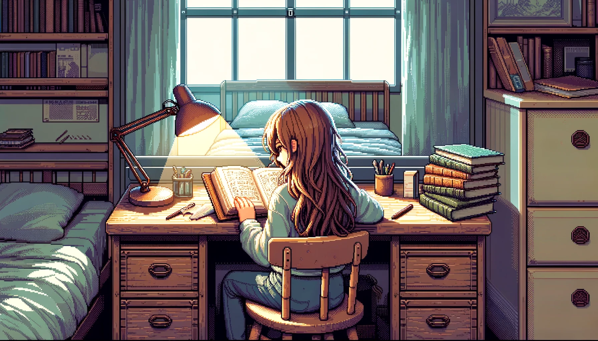

# 🔴⚪ Valais-18 - Jeu vidéo ⚪🔴
# 📖 Le Carnet Mystérieux et le portrait inconnu 🖼

## Description du projet 🖋️
Ce projet est un jeu vidéo pédagogique de type jeu d'aventure. Le jeu commence au 21ème siècle dans la chambre d'une jeune fille. Celle-ci, en lisant un carnet qui lui a été transmis par son grand-père, voyage dans le temps jusqu'en 1815 📅. Le·la joueur.euse joue le personnage de la petite fille. Le jeu se déroule, ensuite, à Monthey (Valais, Suisse) au début du 19ème siècle. Afin de retourner au 21ème siècle, le·la joueur.euse doit retrouver le propriétaire d'un tableau dont elle doit effectuer la livraison 📦. 

👀 tableau de l'inconnu 

## Objectif du jeu ✔️
L'objectif de ce jeu est la découverte de dix personnages qui ont marqué l'histoire du Bas-Valais et plus spécifiquement la ville de Monthey, à la fin du 18ème siècle et au cours du 19ème siècle. Plus spécifiquement, l'objectif est de découvrir Michel Dufour, signataire de l'acte de réunion du Valais à la Confédération helvétique ✍️.

De plus, ce jeu a été pensé pour appartenir à un corpus de dix cours enseignés au secondaire en Valais francophone. Puisque ce jeu appartient au dernier cours du corpus, il a été pensé comme récompense pour les élèves. L'objectif était donc de proposer un jeu, d'une part, éducatif, mais aussi récréatif 🎁. 

## Processus de Développement 👩‍💻
Le jeu a été pensé en collaboration avec Madame Cindy Jaggy et Monsieur Pierre Abbet qui sont les responsables du corpus de cours intitulé Valais-18. A partir de leurs demandes et besoins le jeu a été pensé autour du Bas-Valais, des portraits et spécifiquement de Michel Dufour. L'idée d'un carnet et d'indices comme fil rouge a été inspiré par le jeu Phasmophobia👻. A l'origine, il devait s'y trouver douze portraits, mais il a été décidé de réduire à dix pour s'assurer de ne pas perdre l'attention des élèves avec un surplus d'informations. Les portraits des personnages présents dans le carnet sont historiquement corrects. J'ai effectué les recherches et les textes pour les portraits, Madame Jaggy et Monsieur Abbet ont eu la gentillesse de retravailler les textes pour que le style soit accessible et captivant pour les élèves. De plus, Madame Jaggy a effectué la relecture orthographique du jeu 🙏🏻. 

En ce qui concerne les scènes, le jeu s'inspire d'éléments caractéristiques de Monthey en 1815 comme le pont couvert (construit en 1809) ou le fait que la place n'était pas encore "percée"(1932). Toutefois quelques libertés ont été prises : les bâtiments extérieurs et intérieurs ne sont pas des reproductions, la présence d'un tableau de de Rivaz dans un bâtiment, la présence d'une fontaine sur la place (la fontaine a été déplacée sur la place en 1932), la présence des personnages historiques à Monthey le 31 octobre 1815, le lien relationnel entre Anne-Marie Folken et Louis Robriquet. Le personnage de l'arrière-arrière-arrière-arrière-arrière-arrière-grand-père est complétement inventé 💭. 

Les documents historiques présents dans le jeu sont des documents d'archives conservés aux archives de l'Etat du Valais. Ils ont été sélectionnés après avoir été consulté sur place, puis ils ont été généreusement numérisés par les AEV. Les documents ont été choisis selon deux critères : leur difficulté de compréhension et leur lien avec un personnage. Il était nécessaire de trouver un document dont le contenu n'était pas trop difficile à comprendre pour les élèves, mais aussi qui faisait sens dans le scénario du jeu. Les documents ont été reproduits dans le style graphique du jeu, les textes retranscrits et partiellement modifiés (des parties des documents ont été ignorées, des fautes d'orthographe n'ont pas été reproduites). Le principal changement qui a été effectué concerne CH AEV, Jean Marclay, P 664, le texte "et la prochaine aura lieu le 31 Octobre 1815 à Vouvry" a été inventé, le reste du document est authentique 📜.   

CH AEV, Vieux Monthey, 1436 et sa reproduction. 🔍

Les éléments graphiques du jeu ont été créés avec Dall-E, puis modifiés avec Gimp ✂️.

Avant modifications. 🛏️

Après modifications. ✨

Le jeu propose une version adaptée aux personnes malvoyantes ou dyslexiques. Une première version du jeu ne proposait pas cette option et lors d'un test réalisé auprès d'une personne travaillant avec des personnes malvoyantes, celle-ci a fait remarquer que le jeu serait très difficile, voire inaccessible aux personnes dyslexiques ou malvoyantes❌. De ce fait, une autre version du jeu a été créée dans laquelle les polices "Jupiter Crash BRK" et "Mistral" ont été remplacées par la police "Luciole", et la police "French Script MT" par la police "Verdana". 

Version du carnet avec et sans adaptations pour les personnes malvoyantes ou dyslexiques.👁‍🗨

L'absence de femmes dans les portraits représentait un problème❌. De ce fait, il a été choisi que le personnage principal serait une fille et qu'il n'y aurait pas de possibilité de choisir le genre de son personnage. De plus, le personnage de Anne-Marie Folken a été ajouté pour présenter Louis Robriquet. Elle est mentionnée dans un document d'archives consulté aux AEV(CH AEV, Vieux-Monthey, 472) et il a été décidé de l'inclure dans le jeu ✊🏻. 

## **Outils utilisés** 🔧
- Ce projet a été réalisé en utilisant la librairie Kaboom.js 💣, Visual Studio Code et Tiled 🟦.

- Toutes les images ont été générées par Dall-E🤖 et modifiées avec Gimp🐶❓.

- Les sons et musiques ont été téléchargées sur pixabay.com 💯.

- Les documents d'archives ont été numérisés par les Archives de l'Etat du Valais 💖.

- Le tutoriel de JSLegendDev m'a grandement aidé pour la structure de code et les mécanismes de base 🎞️ (https://www.youtube.com/watch?v=pVAmEJqK-3A.). 

## **Sources Historiques** 📖
Voici les sources qui ont permis d'établir les portraits historiques des personnages présents dans le jeu. 

- Adrien-Félix Pottier

P. Maye: "Pottier, Adrien-Félix", in: Dictionnaire 	historique de la Suisse (DHS), version du 19.12.2008. Online: https://hls-dhs-dss.ch/fr/articles/004122/2008-12-19/, consulté le 29.03.2024.

P. Reichenbach, «Adrien-Félix Pottier (1792-1855)», in Ann. val., 2002, 63-115.

- Alphonse Beck

M. Terrettaz: "Beck, Alphonse", in: Dictionnaire historique de la Suisse (DHS), version du 25.04.2002. Online: https://hls-dhs-dss.ch/fr/articles/042243/2002-04-25/, consulté le 29.03.2024.

- Charles Emmanuel de Rivaz

D. Rey: "Rivaz, Charles Emmanuel de", in: Dictionnaire historique de la Suisse (DHS), version du 09.01.2020. Online: https://hls-dhs-dss.ch/fr/articles/005565/2020-01-09/, consulté le 29.03.2024.

- Michel Dufour

P.-A. Putallaz, «La carrière publique de Michel Dufour (1768-1843) jusqu'en 1810», in Ann. val., 1994, 3-160 (1re partie).

P.-A. Putallaz: "Dufour, Michel", in: Dictionnaire historique de la Suisse (DHS), version du 14.02.2006. Online: https://hls-dhs-dss.ch/fr/articles/005561/2006-02-14/, consulté le 29.03.2024.

- Emile Vuilloud

V. G. Talamona: "Vuilloud, Emile", in: Dictionnaire historique de la Suisse (DHS), version du 30.08.2013, traduit de l’italien. Online: https://hls-dhs-dss.ch/fr/articles/019446/2013-08-30/, consulté le 29.03.2024.

- Joseph Torrent

B. Truffer: "Torrent, Joseph", in: Dictionnaire historique de la Suisse (DHS), version du 
01.03.2011, traduit de l’allemand.
Online: https://hls-dhs-dss.ch/fr/articles/032725/2011-03-01/, consulté le 29.03.2024.

- Louis Robriquet

I. Carruzzo: "Robriquet, Louis", in: Dictionnaire historique de la Suisse (DHS), version du 16.05.2012. Online: https://hls-dhs-dss.ch/fr/articles/021436/2012-05-16/, consulté le 29.03.2024.

P.-A. Grenat, J. de Lavallaz. (1904). Histoire moderne du Valais : de 1536 à 1815. V. Pasche.

- Pierre Guillot 

F. Giroud: "Guillot, Pierre", in: Dictionnaire historique de la Suisse (DHS), version du 13.03.2008. Online: https://hls-dhs-dss.ch/fr/articles/021368/2008-03-13/, consulté le 29.03.2024.

- Pierre Louis du Fay

M. Terrettaz: "Fay, Pierre Louis du", in: Dictionnaire historique de la Suisse (DHS), version du 22.11.2004. Online: https://hls-dhs-dss.ch/fr/articles/021267/2004-11-22/, consulté le 29.03.2024.

- Pierre Maurice Rey-Bellet

P. Devanthey, La révolution bas-valaisanne de 1790, 1972.

P.Reichenbach: "Rey-Bellet, Pierre-Maurice", in: Dictionnaire historique de la Suisse (DHS), 
version du 01.09.2010. Online: https://hls-dhs
-dss.ch/fr/articles/021336/2010-09-01/, consulté le 29.03.2024.

## Contexte de développement 💡
Ce projet a été développé dans le cadre du cours "Developpement Jeu Vidéo 2D" (printemps 2022) enseigné par le Prof. Isaac Pante (SLI, Lettres, UNIL). 👩🏼‍🎓
Afin que le jeu soit utilisé au delà d'une validation de cours, j'ai proposé à madame Cindy Jaggy et Monsieur Pierre Abbet de le créer pour l'intégrer à leur corpus de cours. Le jeu est disponible à cette adresse (https://valais18.vallesiana.ch/jeu) 🔗.

